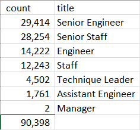
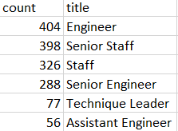

# Pewlett_Hackard_Analysis

# Overview: 
#### The purpose of this analysis is to identify the number of PH employees retiring and to identify which PH employees are eligible to participate in a mentorship program
# Results: 
#### Provide a bulleted list with four major points from the two analysis deliverables. Use images as support where needed.

# Summary: 
#### -Provide high-level responses to the following questions, then provide two additional queries or tables that may provide more insight into the upcoming "silver tsunami."
#### -How many roles will need to be filled as the "silver tsunami" begins to make an impact?
#### -Are there enough qualified, retirement-ready employees in the departments to mentor the next generation of Pewlett Hackard employees?
#### There is a bulleted list with four major points from the two analysis deliverables. (6 pt)
#### The summary addresses the two questions and contains two additional queries or tables that may provide more insight. (5 pt)

