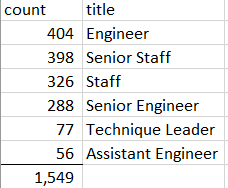

# Pewlett_Hackard_Analysis

# Overview: 
#### The purpose of this analysis is to identify the number of PH employees retiring and to identify which PH employees are eligible to participate in a mentorship program.
# Results: 
#### The following figure shows the number of employees that will be retiring:

#### The following figure shows the number of retiring employees that are eligible for a mentorship program:

#### Employees who are eligible for the mentorship program are those whose birth dates fall between January 1, 1965 and December 31, 1965. 
# Summary: 
#### -Per review of employee data provided by Pewlett Hackard, a total of 90,398 employees will be retiring, creating vacant posistions that need to be filled. 
#### -Per review of employee data provided by Pewlett Hackard, a total of 1,549 employees are eligible for a mentorship program.  Among these employees, there are no managers preparing to retire who are eligible for the mentorship program; therefore, Pewlett Hackard will have a shortage of eligible mentors for upcoming managers. 
#### An additional table that may provide more insight on the impact of the upcoming "silver tsunami" would be to identify how many employees in each department will be retiring.
#### Another useful table table would be to show the count of employees that will remain in each department after retired employees have left.  This will allow Pewlett Hackard management to analyze the impact that retirements will have on each department.  

